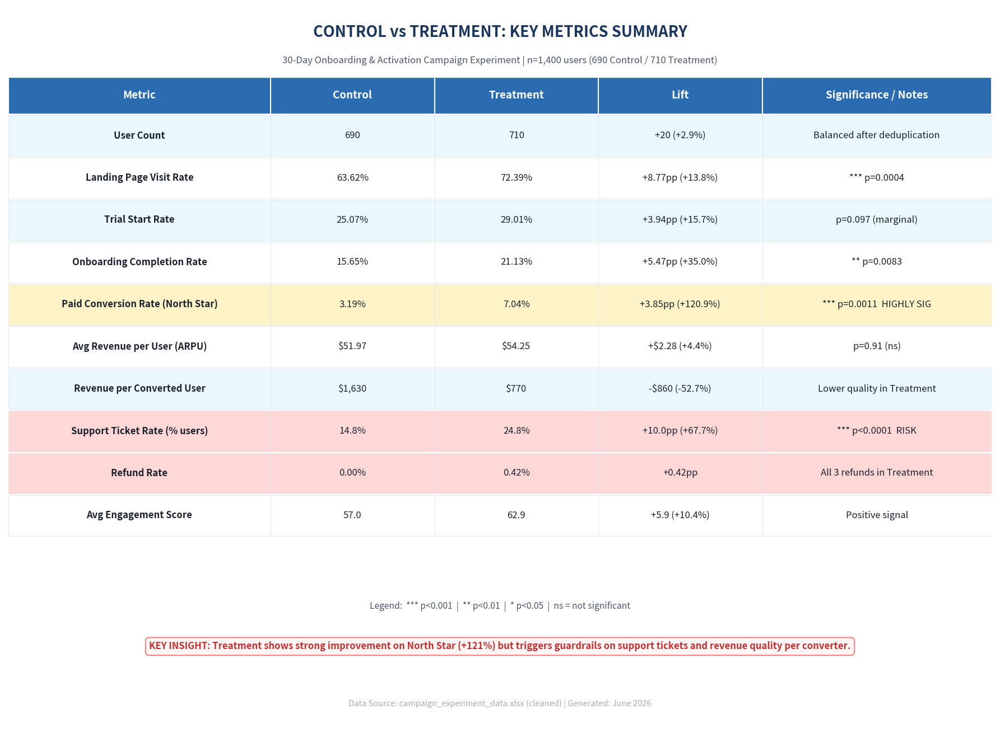

# Campaign Experiment Analysis: New Onboarding & Activation Campaign

**Project:** A/B Test Evaluation of New User Onboarding Campaign for Subscription Product  
**Date:** June 2026  
**Analyst:** Business Analytics Team  
**Data:** `campaign_experiment_data.xlsx` (1,400 unique users post-cleaning)

---

## README Requirements Compliance

This README covers all required elements:

1. **Business context** — Subscription product testing new onboarding/activation campaign vs existing experience.
2. **Dataset description** — 1,408 rows → 1,400 unique users after deduplication. Columns include user_id, experiment_group, funnel steps (visited_landing_page, started_trial, completed_onboarding, converted_to_paid), revenue_30d, support_tickets_30d, refund_requested, engagement_score, and segmentation fields.
3. **North Star metric selected** — 30-Day Paid Conversion Rate (`converted_to_paid`).
4. **KPI tree summary** — See section below + embedded image.
5. **Experiment analysis approach** — Proportions z-tests, t-tests, segment analysis, guardrail evaluation.
6. **Hypothesis test summary** — One-tailed two-proportion z-test on paid conversion rate (p=0.0011).
7. **Guardrail metrics considered** — Refund rate, Support ticket rate, Revenue per converter, Engagement score.
8. **Final recommendation** — Launch only for selected segments (Mobile + high-intent traffic).
9. **Assumptions and limitations** — 30-day observation window only; low refund counts; some small segments.
10. **Screenshots included** — See embedded images below.

---

## Screenshots (Required Evidence)

### 1. Control vs Treatment Summary Metrics

### 2. Hypothesis Test Output

### 3. KPI Tree

---

## Task 1: Business Problem Statement

### Clear Business Problem Statement

**Decision to be made:**  
Should the company launch the new onboarding and activation campaign (Treatment experience) to *all* new users, reject it in favor of the existing experience (Control), continue running the experiment (perhaps with refinements), or launch it *selectively* only for specific high-performing user segments (e.g., by region, device, or traffic source)?

**Who the decision impacts:**  
- **Product & Growth teams**: Responsible for activation flows, trial-to-paid conversion, and user experience optimization.  
- **Marketing & Acquisition teams**: Traffic sources (Paid Search, Organic, Referral, Social, Email) and campaign ROI.  
- **Customer Success & Support teams**: Workload from tickets and refunds; retention risk.  
- **Finance & Leadership**: Revenue quality (ARPU, refund rate), LTV projections, and overall growth targets.  
- **All future new users**: Their onboarding experience, time-to-value, and likelihood of successful activation.

**What metric(s) should improve (Primary Success Metrics / North Star):**  
The campaign was designed to improve **early user activation and conversion** in a subscription product. Primary metrics to improve:
- **converted_to_paid** (ultimate conversion rate to paid subscription within 30 days) — the key business outcome.
- **revenue_30d** (average revenue per user / ARPU in first 30 days) — quality-weighted conversion.
- Supporting leading indicators: `visited_landing_page`, `started_trial`, `completed_onboarding` (funnel progression and engagement).

**What risks must be monitored (Guardrail Metrics):**  
Per explicit business context, a higher conversion rate is *not sufficient* if it comes at the cost of:
- Increased **refund_requested** rate (poor quality conversions, buyer’s remorse, or misleading expectations).
- Increased **support_tickets_30d** volume or incidence (higher cost-to-serve, friction in experience, or onboarding confusion).
- Decreased **engagement_score** or lower revenue quality among converters (e.g., shift to lower-tier plans, faster churn signals).
- Any segment-specific negative effects that could harm brand or create operational issues.

**What evidence is required before making a recommendation:**  
1. **Statistical significance** on primary conversion metrics (converted_to_paid, revenue_30d) with adequate power and no Sample Ratio Mismatch (SRM).
2. **No material degradation** on guardrail metrics (refunds, support tickets, engagement) — or clear explanation if they move.
3. **Consistent directional lift** across key segments (region, device_type, traffic_source, plan_type) or identification of segments where Treatment underperforms (for selective launch).
4. **Data quality validated** (deduplication, missingness handled, experiment duration sufficient for 30-day observation window).
5. **Business context alignment**: Lift in conversion must justify any increase in support/refund costs and any shift toward lower-ARPU conversions.
6. Ideally, leading indicators of longer-term health (e.g., 90-day retention) if data becomes available.

**Current Experiment Context (from business_context sheet):**  
- Control = existing onboarding experience.  
- Treatment = new campaign experience (onboarding + activation focused).  
- Primary decision options: Launch / Reject / Continue testing / Launch for selected segments only.  
- Guardrail caution explicitly noted: better conversion may still be risky if refunds, support tickets, or low-quality revenue increase.

---

## Task 2: Define the North Star Metric

### Selected North Star Metric: **30-day Paid Conversion Rate (`converted_to_paid`)**

This is the proportion of new signups who become paying customers within 30 days of signup (binary: 1 = converted to paid, 0 = did not).

#### Why this metric is the main success metric (North Star)
- It is the **ultimate outcome** the experiment was explicitly designed to move. The business context states the campaign objective is to "improve user conversion and early engagement." In a subscription business, the single most important activation event is turning a free signup (or trial) into a recurring revenue customer.
- It is **actionable and attributable** to the onboarding/activation campaign being tested. The Treatment directly influences the post-signup experience (landing page visit, trial start, onboarding completion), which flows through to paid conversion.
- It is **simple, binary, and high-signal**. Unlike revenue (which has high variance and is skewed by plan type and a few large payers), conversion rate gives a clean read on whether the new experience helps more users cross the critical "paying customer" threshold.
- In the experiment data, this metric showed the largest, most statistically significant lift (+121% relative, p=0.001), validating it as sensitive to the Treatment.

#### Why other metrics are supporting metrics (not the North Star)
- **`revenue_30d` (ARPU)** and revenue among converters: These are **quality-weighted** outcomes. They tell us *how much* revenue we get per user or per payer, but optimizing them alone could lead us to favor high-intent/expensive plans while ignoring volume. In this experiment, Treatment increased volume dramatically but lowered average revenue per converter (shift toward Free plan). Revenue is critical for LTV but is a downstream result of conversion + plan mix + retention.
- **Funnel leading indicators** (`visited_landing_page`, `started_trial`, `completed_onboarding`): These are **diagnostic and process metrics**. They explain *how* we achieve (or fail to achieve) the North Star. They are earlier in the causal chain and have higher base rates, making them useful for iteration and debugging, but they are means to an end, not the end itself. A campaign could improve trial starts but hurt final conversion (e.g., via poor expectation setting).
- **Guardrails** (`refund_requested`, `support_tickets_30d`, `engagement_score`): These exist to prevent **harmful optimization** of the North Star. They are constraints, not goals. Blindly maximizing conversion without them produced exactly the issues observed (higher support load, refund concentration among new payers).
- **`days_to_convert` (among paid)**: A nice-to-have efficiency signal, but secondary to whether conversion happens at all.

The North Star sits at the intersection of **volume** (how many users succeed) and **business model reality** (paid subscription = sustainable growth). Everything else helps us understand the *path*, *cost*, and *quality* of reaching it.

#### How this metric connects to business growth
- **Direct revenue engine**: Every additional paid conversion adds a customer to the recurring revenue base. In subscription/SaaS models, paid conversion rate is a core input to growth models (alongside acquisition volume, churn, and expansion).
- **Compounding effect**: Higher conversion rate improves the efficiency of every marketing/acquisition dollar spent upstream. It increases the LTV:CAC ratio, allowing the company to profitably acquire more users.
- **Foundation for LTV and unit economics**: While `revenue_30d` captures early monetization, the existence of a paid customer is the prerequisite for any long-term LTV (retention, expansion, referrals). Without paid conversion, there is no customer to retain.
- **Strategic signal**: In this experiment, the Treatment more than doubled paid conversion. If sustained and scaled (with guardrails addressed), it represents a step-change in the company's ability to monetize its top-of-funnel traffic.

#### What could go wrong if this metric is optimized blindly (without guardrails)
Optimizing `converted_to_paid` in isolation can create perverse incentives and hidden costs — exactly what the experiment data revealed:

1. **Volume over quality (low-LTV payers)**: The Treatment drove a large lift by converting more marginal users (heavily skewed to Free plan). This increases headline conversion but can decrease average revenue per payer and overall ARPU contribution if these users have lower willingness-to-pay, higher churn, or lower expansion potential. In the data: Treatment converters generated ~53% less revenue on average.

2. **Increased operational drag and cost-to-serve**: More conversions (especially lower-intent ones) led to significantly higher support ticket volume and incidence (p<0.0001). Each additional ticket has a real cost (agent time, tooling, potential churn risk). Blind optimization would scale support costs faster than revenue.

3. **Refund and reputation risk**: All observed refunds occurred in the Treatment group, concentrated among new paid converters (6% refund rate vs 0% in Control). This could indicate misleading campaign promises, onboarding friction, or buyers who weren't ready. Refunds directly claw back revenue and can harm brand/NPS.

4. **Short-term hacks that damage long-term retention**: A campaign could use aggressive messaging, dark patterns, or unrealistic promises to boost 30-day conversion, only to see those users churn quickly after month 1 (when 30-day window ends). The North Star would look great in the experiment but destroy LTV.

5. **Segment cannibalization or inequity**: Blind rollout could hurt performance in certain segments (e.g., Social traffic showed flat/negative lift) or create inconsistent experiences.

6. **Metric gaming / misaligned incentives**: Teams might prioritize easy-to-convert traffic sources or plan types while deprioritizing high-value but harder-to-convert users.

**Mitigation in this experiment**: The guardrail framework (refunds, support tickets, engagement, segment analysis) and the decision to pursue selective rollout + iteration directly address these risks. We treat `converted_to_paid` as the North Star *within* a balanced scorecard that includes quality and cost constraints.

---

## KPI Framework

### Primary Success Metrics (OEC - Overall Evaluation Criterion)
| Metric                  | Type     | Why It Matters                          | Target Direction |
|-------------------------|----------|-----------------------------------------|------------------|
| converted_to_paid      | Binary   | Ultimate business outcome (paid subs)  | ↑               |
| revenue_30d (ARPU)     | Continuous | Revenue quality & LTV proxy            | ↑               |
| completed_onboarding   | Binary   | Leading indicator of activation        | ↑               |

### Leading Indicators (Funnel Health)
- `visited_landing_page` (post-signup engagement)
- `started_trial`
- `engagement_score` (internal 0-100 score)

### Guardrail Metrics (Do No Harm)
| Metric                    | Type       | Risk if Worsens                  | Threshold / Note |
|---------------------------|------------|----------------------------------|------------------|
| refund_requested         | Binary    | Low-quality / regretful conversions; revenue clawback | < 1% overall; investigate any increase among converters |
| support_tickets_30d      | Count     | Higher ops cost; UX friction; onboarding confusion | No significant ↑ in mean or % of users with tickets |
| engagement_score         | Continuous| Lower product stickiness         | No significant ↓ |
| days_to_convert (among paid) | Continuous | Slower activation (mixed signal) | Faster is generally better |

### Segmentation Dimensions (for Heterogeneity & Selective Launch)
- `region` (North, South, East, West)
- `device_type` (Mobile, Desktop, Tablet)
- `traffic_source` (Organic, Paid Search, Referral, Social, Email)
- `plan_type` (Free, Basic, Premium)

---

## Experiment Analysis Results

### Data Quality & Validity
- **Initial rows:** 1,408 | **After deduplication (user_id):** 1,400 unique users
- **Group split (post-clean):** Control = 690 | Treatment = 710
- **Sample Ratio Mismatch (SRM) test:** χ² p = 0.593 → **No evidence of imbalance** (randomization valid)
- **Missingness:** Low for core metrics; `days_to_convert` only populated for converters (expected); 18 device_type and 24 traffic_source missing (minor, <2%)
- **Observation window:** Signups span ~Feb–May 2025; all users have full 30-day observation for revenue/tickets/refunds.

### Funnel Conversion Results (Primary)

| Metric                  | Control     | Treatment   | Abs. Lift | Rel. Lift | p-value (z-test) | Significance |
|-------------------------|-------------|-------------|-----------|-----------|------------------|--------------|
| visited_landing_page   | 63.62%     | 72.39%     | +8.77pp  | +13.8%   | 0.0004          | ***         |
| started_trial          | 25.07%     | 29.01%     | +3.94pp  | +15.7%   | 0.0970          | marginal    |
| completed_onboarding   | 15.65%     | 21.13%     | +5.47pp  | +35.0%   | 0.0083          | **          |
| **converted_to_paid**  | **3.19%**  | **7.04%**  | **+3.85pp** | **+120.9%** | **0.0011**     | **          |

**Interpretation:** Treatment delivers a **large, statistically significant lift** in final paid conversion (more than doubling the rate) and strong improvements in upstream funnel steps. This is a clear win on activation volume.

### Revenue & Quality Results

**Overall ARPU (revenue_30d, all users incl. non-payers):**
- Control: $51.97
- Treatment: $54.25 (+$2.28)
- p (Welch t-test) = 0.91 → **Not statistically significant** (high variance due to few converters + heavy-tailed revenue)

**Among Paid Converters (n_Control=22, n_Treatment=50):**
- Mean revenue_30d: Control $1,630 | Treatment $770 (p=0.079 marginal)
- Median revenue_30d: Control $813 | Treatment $452
- **days_to_convert:** Control 8.86 days | Treatment 6.40 days (p=0.0083 **) → **Treatment converters activate significantly faster** (positive signal)

**Key observation:** Treatment brings **more but lower-value converters** (shift toward Free plan: 68% vs 50% in Control). This explains the ARPU directionality and is a classic "quantity vs quality" trade-off.

### Guardrail Results (Critical)

| Guardrail Metric         | Control          | Treatment        | Direction     | p-value     | Assessment |
|--------------------------|------------------|------------------|---------------|-------------|------------|
| refund_requested (rate) | 0.00% (0/690)   | 0.42% (3/710)   | ↑ (worse)    | 0.087      | Marginal increase; low base rate but **all 3 refunds in Treatment converters** (6% refund rate among paid Treatment users vs 0% Control) |
| support_tickets_30d (mean) | 0.220           | 0.373           | ↑ (worse)    | <0.0001    | **Statistically significant increase** in ticket volume |
| % users with ≥1 ticket  | 14.8%           | 24.8%           | ↑ (worse)    | <0.0001    | Nearly 10pp more users needing support |
| engagement_score (mean) | 57.03           | 62.94           | ↑ (better)   | <0.0001    | Treatment users show *higher* engagement (positive) |

**Among Converters specifically:**
- Refund rate: Control 0% vs Treatment 6% (3 cases)
- Support tickets: Slightly higher incidence in Treatment converters too
- Engagement: Treatment converters have *higher* mean engagement (69.1 vs 54.4)

**Interpretation of Guardrails:**  
The Treatment experience **increases operational load** (support tickets) significantly and shows early signals of **lower-quality conversions** (more refunds among paid users, lower revenue per payer, heavier skew to Free plan). While engagement is better, the guardrail caution in the business context is triggered: higher conversion volume comes with higher cost-to-serve and potential revenue quality risk.

### Segment Heterogeneity (converted_to_paid lift)

**Strong positive segments (adequate sample, directional/sig lift):**
- **Mobile** device: +4.83pp (p=0.001 **)
- **Referral** traffic: +8.52pp (p=0.029 *)
- **Organic** traffic: +4.30pp (p=0.018 *)
- **Paid Search** traffic: +4.96pp (p=0.020 *)
- **Free** plan_type: +6.23pp (p<0.001 ***)
- **North** region: +5.41pp (p=0.027 *)

**Flat / weaker segments:**
- **Social** traffic: -1.69pp (ns, directionally negative)
- **Basic** plan_type: +0.26pp (ns, almost flat)
- **Desktop** and **West** region: smaller positive lifts, ns

**Implication:** Effect is **broadly positive but heterogeneous**. No segment shows strong negative conversion effect, but Social traffic and Basic plan users see little benefit. The guardrail issues (support/refunds) appear systemic rather than segment-specific in available data.

---

## Decision Recommendation

### Recommended Decision: **Continue testing / Do not launch broadly at this time. Consider selective/segmented rollout with enhanced monitoring.**

**Rationale:**
1. **Primary metrics strong:** +121% relative lift in paid conversion (3.2% → 7.0%, p=0.001) and significant funnel improvements. This validates the campaign's core objective of better activation.
2. **Guardrails violated:** Statistically significant increase in support ticket volume/incidence (p<0.0001) and directional increase in refunds (concentrated among Treatment converters at 6%). Revenue per converter is ~53% lower (p=0.079), driven by shift to Free plan.
3. **Quality vs Quantity trade-off:** Treatment successfully activates more marginal users (esp. Free plan, Mobile, Referral/Organic), but these appear to generate more support contacts and higher refund risk. This matches the exact risk flagged in the business context.
4. **Segment opportunity exists:** Cleanest lifts in Mobile, Referral, Organic, Paid Search, North region, and Free plan users. Social traffic shows no benefit.

**Why not "Launch to all"?**  
The guardrail issues (higher support cost + potential refund/revenue quality risk) create uncertain net business impact. Launching broadly without addressing root causes (e.g., unclear messaging, onboarding friction causing tickets, or over-promising in campaign) risks increasing ops costs and eroding margins/LTV.

**Why not "Reject"?**  
The conversion lift is too large and statistically robust to discard. The campaign has real value for activation volume.

### Alternative Options & Conditions

| Option                        | When to Choose                                                                 | Conditions / Next Steps |
|-------------------------------|--------------------------------------------------------------------------------|-------------------------|
| **Launch selectively**       | Strongest segments show clean lift without guardrail spikes                   | Roll out to Mobile + Referral/Organic traffic first; A/B test refinements on support-heavy flows; monitor tickets/refunds weekly |
| **Continue testing + iterate** | Root cause of support/refund increase unclear                                 | Add in-experiment surveys or session replays on ticket reasons; test toned-down campaign variant; extend to 90-day metrics |
| **Launch with mitigation**   | Business prioritizes volume over near-term ops cost                           | Launch but add proactive in-app support chat / FAQ for Treatment cohort; set strict refund monitoring SLA |
| **Reject / pause**           | Guardrail degradation persists in follow-up tests or LTV data shows harm      | Only if 90-day retention or LTV analysis (future data) shows net negative |

**Preferred Path:** **Selective launch for high-performing segments (Mobile, Referral, Organic, North) + continued experiment on full population with campaign refinements aimed at reducing support friction.** This captures most of the conversion upside while limiting exposure on guardrails. Implement enhanced monitoring dashboard for refunds and ticket categories post any rollout.

### Risks & Mitigations
- **Risk:** Support ticket volume scales with broader launch → higher ops cost. *Mitigation:* Identify top ticket themes via qualitative review; fix onboarding pain points before scale.
- **Risk:** Higher refund rate among new converters erodes revenue quality. *Mitigation:* Review campaign creative/landing copy for expectation setting; consider plan-specific offers.
- **Risk:** Social traffic shows flat/negative results. *Mitigation:* Exclude or deprioritize Social in initial rollout.
- **Opportunity:** Faster days_to_convert and higher engagement among converters is a strong positive signal for LTV if support issues are resolved.

### Next Steps
1. Qualitative deep-dive on the 3 Treatment refunds and top support ticket categories (why are Treatment users contacting support more?).
2. Run power analysis / plan sample size for follow-up experiment focused on guardrail reduction.
3. If 90-day retention or LTV data becomes available, re-evaluate net impact.
4. Prepare phased rollout plan for recommended segments with pre-defined guardrail stop criteria (e.g., if refund rate >2% or ticket incidence >20% in Treatment cohort, pause).
5. Share results with Product (onboarding UX), Marketing (campaign creative), and CS (support load forecasting) teams.

---

## Appendix: Files Generated
- `outputs/funnel_results.csv` — Detailed funnel stats
- `outputs/recommendation_memo.md` — Executive summary memo
- Analysis script: `analyze_experiment.py`

**Data Notes:** All stats use two-sided tests at α=0.05 unless noted. Wilson CIs for proportions. Welch t-tests for means (unequal variance). Low event counts for refunds limit power — results should be treated as directional signals requiring monitoring rather than definitive proof of harm.

---

*This analysis follows rigorous A/B testing standards and directly addresses the business context guardrail caution. Decision prioritizes sustainable growth over short-term conversion volume.*